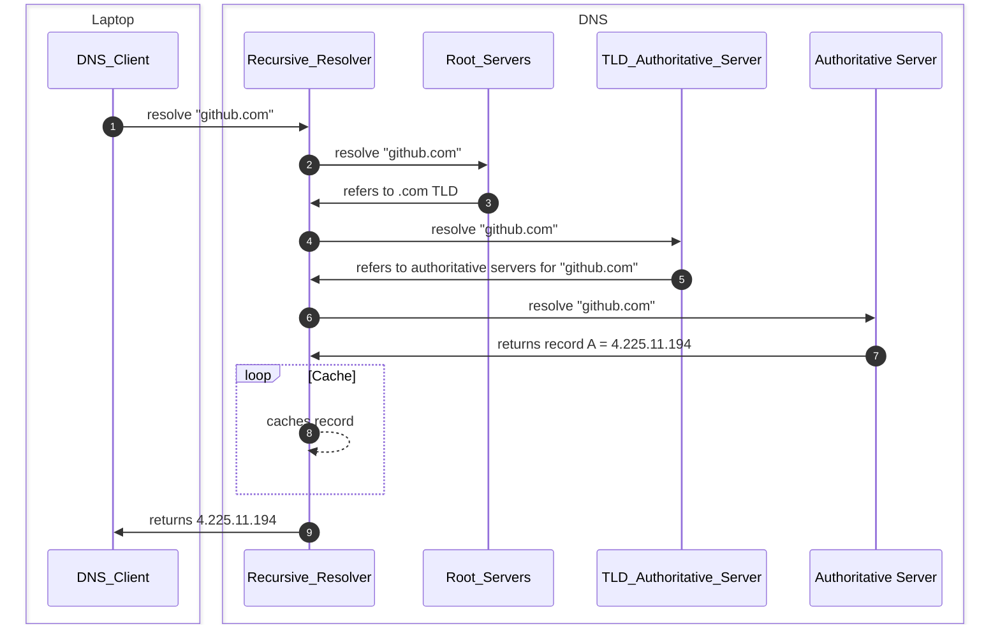

### Diagram

### Diagram Description

1. **DNS Client** queries **Recursive Resolver** to resolve **FQDN** (Fully Qualified Domain Name) __github.com.__
2. The **Recursive Resolver** queries **Root Name Server** __(.)__ for __github.com.__
3. The **Root Name Server** refers **Recursive Resolver** to the (.com) **TLD** (Top-Level Domain) **Authoritative Server**
4. The **Recursive Resolver** queries the __.com__ **TLD Authoritative Server** for __github.com.__
5. The __.com__ **TLD Authoritativer Server** refers **Recurisve Server** to the **Authoritative Servers** for __github.com.__
6. The **Recursive Resolver** queries the **Authoritative Servers** __github.com.__
7. The **Authoritative Server** returns A record answer = __4.225.11.194__
8. Optional - **Recursive Resolver** caches DNS record for some fixed time or TTL defined in the record
8. The **Recurisve Resolver** returns record to **DNS Client**

