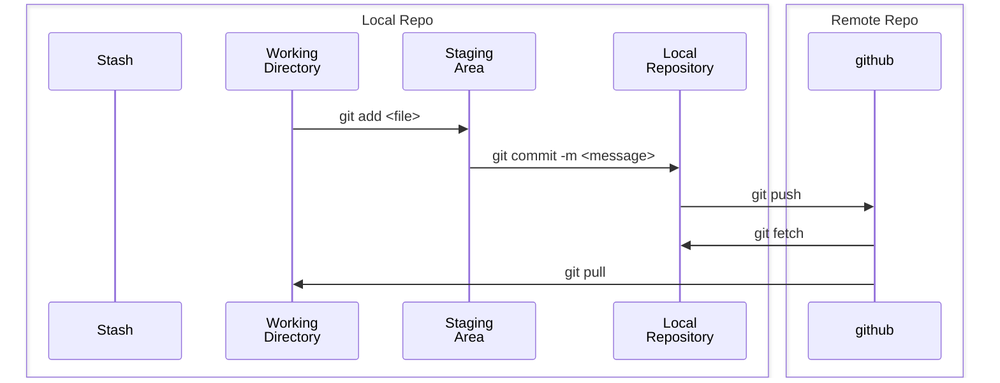

## Diagram



## Commands

Remove local branch
```bash
git branch --delete [local_branch_name]
```

Remove remote branch
```bash
git push origin --delete [remote_branch_name] 
```

Reset current Head to specified state
```bash
git reset --hard
```

Remove untrucked files
```bash
git clean -n         # Remove untracked files from work tree -- dry run
git clean -f         # Remove untracked files from work tree -- force
git clean -f -d -x   # Remove untracked files, directories, even ignored
```

Pull submodules
```bash
git pull --recurse-submodules && git submodule update --init --recursive
# main
git submodule foreach --recursive 'git checkout main && git submodule update --init --recursive'
# master
git submodule foreach --recursive 'git checkout master && git submodule update --init --recursive'
# Figure out default branch
git submodule foreach --recursive 'git checkout $(git remote show origin \
  | sed -n 's/  HEAD branch: //p') && git submodule update --init --recursive'
```

Create Alias for git command
```bash
git config --global alias.where '!git branch'
git where
```

Set Global Config
```bash
git config --global user.name [username]
git config --global user.email [email]
git config --global credential.username [username]
git config --global init.defaultbranch "main"
git config --global --list
```

Set Local Config
```bash
git config --local user.name [username]
git config --local user.email [email]
git config --local credential.username [username]
git config --local --list
```
